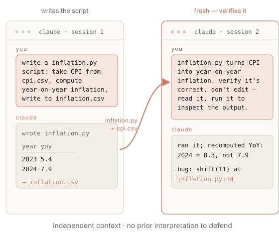

<!-- _class: title -->
<!-- _paginate: false -->

# AI Tools for Economics Research

Session 3 — How it goes wrong
Monday 22 June 2026
10:30–12:00 · 14:30–16:00
Banco de Portugal
João B. Sousa · Nova SBE

---

<!-- _class: center -->

<h4>Today</h4>

## What goes wrong, and how to catch it.

Friday's session showed the agent producing usable work. This one looks at how it fails, and the habits that minimize those failures.

---

<!-- _class: divider -->
<!-- _paginate: false -->

01

## How it goes wrong.

---

<h4>The starting point</h4>

## Fluency is the default. Accuracy is not.

The model returns an answer that fits the request. When you have given it everything it needs, the fit is usually correct. When something is missing or unclear, fit wins — and fills the gap with something plausible.

A made-up answer (a "hallucination") is not a malfunction. It is the model doing its normal job.

---

<h4>Made-up answers</h4>

## Where the gaps come from.

<ul>
<li><strong>A bad PDF read</strong> &nbsp; part of a PDF is missed (e.g. a table), so the model never sees it.</li>
<li><strong>A partial read</strong> &nbsp; the agent reads the first rows of a large file; a later break is missed.</li>
<li><strong>A lost summary</strong> &nbsp; an earlier file gets summarised, and the detail goes with it.</li>
<li><strong>A habit from training</strong> &nbsp; the model fills a gap with whatever is usually true.</li>
</ul>

---

<!-- _class: center -->

<h4>Friday, revisited</h4>

## Why the quote-with-page rule is not enough.

The rule made each claim checkable. But it cannot stop a made-up answer when the paper never reached the model: one wrong file name or a failed read, and the model still produces a fluent sentence with a believable page number — from memory (training), not from the PDF.

The rule makes a made-up answer easy to catch, not impossible to produce. The page still warrants opening.

---

<!-- _class: split -->

<h4>Live demo</h4>
<h2>One prompt, two models.</h2>

Friday's six-paper folder, plus two papers that are not in it. Every cell must be filled. The same prompt runs first on the default model, then on a smaller one.

Live demonstration.

<pre><code>papers/inflation_expectations/
has six PDFs. I need a
complete comparison table,
one row per paper: Paper |
Main estimate | Supporting
quote | Page. Include the six
papers in the folder plus
Mankiw and Reis (2002) and
Coibion and Gorodnichenko
(2012). Every cell must be
filled — no blanks, the table
goes straight into slides.
Abstract/intro of each PDF
is enough.</code></pre>

---

<h4>What came back</h4>

## Same gap, two answers.

<ul>
<li><strong>Default model</strong> &nbsp; quotes with page numbers; flags the two missing papers as unverifiable.</li>
<li><strong>Smaller model</strong> &nbsp; a full table with no flags — quotes and pages for papers it never opened.</li>
</ul>

A tendency, not a guarantee — the cited page still warrants opening.

---

<!-- _class: split -->

<h4>Context drift</h4>
<h2>Two reasons it happens.</h2>

<ul>
<li><strong>Nothing gets removed</strong> &nbsp; old results and earlier wrong guesses stay in view and pull later answers toward them.</li>
<li><strong>The latest step wins</strong> &nbsp; the most recent result crowds out the original task, which has dropped out of view.</li>
</ul>

Both come from the same thing: the conversation only grows, and nothing leaves it.

---

<h4>What makes it worse</h4>

## Two things that make it worse.

<ul>
<li><strong>Automatic summarising</strong> &nbsp; when the conversation gets long, the tool quietly replaces the earlier part with a summary. The summary loses detail, and you did not write it.</li>
<li><strong>Defending its first answer</strong> &nbsp; once the model has settled on a reading, later answers tend to defend it rather than recheck it.</li>
</ul>

The signs: answers stop matching the question, or the same correction is needed twice.

---

<h4>Three more, in research work</h4>

## Failures that survive a glance.

<ul>
<li><strong>Quiet code changes</strong> &nbsp; a fix that also reformats, renames, or "improves" a line you never asked about.</li>
<li><strong>Invented data</strong> &nbsp; a missing value filled in by guessing, or a series stretched past where the data ends.</li>
<li><strong>Confident wrong answers</strong> &nbsp; the tone is the same whether the model knows or is guessing.</li>
</ul>

---

<!-- _class: divider -->
<!-- _paginate: false -->

02

## Verification habits.

---

<!-- _class: center -->

<h4>The idea</h4>

## Each check matches its failure.

Each kind of failure has a quick check that catches it. The habit is to run that check before the result reaches your draft, rather than trusting how good the answer looks.

---

<h4>Habit 1</h4>

## Every change is worth reading.

The agent shows each edit before it takes effect, and it repays reading. A one-line change is a one-line read; a hundred-line "fix" to a one-line problem is the signal to stop.

Version control is the safety net — it records each change and can undo it. But reading the change before you approve it is the cheapest place to catch a quiet edit.

---

<h4>Habit 2</h4>

## Every data edit lives in code.

<ul>
<li><strong>The agent writes the code, not the numbers</strong> &nbsp; each change to the data is a line you can read, not a value typed straight into a cell.</li>
<li><strong>Reading the code covers the whole dataset</strong> &nbsp; one read of the steps stands in for every row, where checking values one by one never could.</li>
<li><strong>Friday's <code>shift(11)</code> error</strong> &nbsp; a one-line mistake, caught by reading the code rather than scanning the numbers it produced.</li>
</ul>

---

<!-- _class: split -->

<h4>Habit 3</h4>
<h2>A fresh agent makes the better reviewer.</h2>

The session that wrote the code is the worst to review it — it will defend its own reading. A new session, told what the code should do, can read and run it to check, not change it.

A clean start, nothing to defend — like a second referee.

---

<h4>Habit 4</h4>

## Every claim can point to its evidence.

The agent can be asked to quote the passage it relied on and say where it came from — for a paper, the page; for a number, the file and line. Then you can open it. The quote does not prove the claim; it shows exactly what to check.

Back to §1: the rule turns a summary you cannot check into one you can.

---

<!-- _class: takeaways -->

<h4>End of morning</h4>

## Where we are.

<ol>
<li><strong>A made-up answer is the default when the input is incomplete</strong> — the model aims for fluency, not accuracy.</li>
<li><strong>The conversation drifts as it grows</strong> — summarising and self-defence make it worse.</li>
<li><strong>Each check matches its failure</strong> — the change read, the data edits in code, a fresh agent consulted, every claim tied to its source.</li>
</ol>

After lunch: writing prompts, then what it costs.

---

<!-- _class: center -->
<!-- _paginate: false -->

<h4>Break</h4>

14:30

Back after lunch.

---

<!-- _class: divider -->
<!-- _paginate: false -->

03 · AFTERNOON

## Writing better prompts.

---

<!-- _class: center -->

<h4>The lever, again</h4>

## Most failures come from a vague request.

A vague request gets a vague result. A tightly defined task is the cheapest defence against both made-up answers and drift.

---

<h4>One thing at a time</h4>

## One task at a time.

A request with one goal produces a change you can review and a result you can check. A request with five goals produces a wall of changes and no clean place to stop.

A request with an "and" in it is often two requests.

---

<h4>Say it up front</h4>

## The prompt patterns from Friday.

<ul>
<li><strong>Say what the output should look like</strong> &nbsp; columns, file names, types — name what you want back.</li>
<li><strong>"Do not edit"</strong> &nbsp; keep finding the problem and fixing it in separate steps.</li>
<li><strong>"Stop and ask if ambiguous"</strong> &nbsp; turns a silent wrong guess into a question.</li>
<li><strong>Quote with the source</strong> &nbsp; so every claim can be checked.</li>
</ul>

---

<h4>When to restart</h4>

## Four signals to start fresh.

<ul>
<li><strong>The topic changes</strong> &nbsp; the earlier conversation is now just noise.</li>
<li><strong>Corrected twice</strong> &nbsp; the same fix needed again means it is stuck on its first answer.</li>
<li><strong>Answers stop matching</strong> &nbsp; the reply no longer fits the question; it has drifted.</li>
<li><strong>About to check the work</strong> &nbsp; a review needs a fresh start.</li>
</ul>

---

<!-- _class: split -->

<h4>Vague</h4>

<pre><code>clean up the inflation
data and make it nice
for the paper</code></pre>

No format, no file names, no stopping rule. The gaps get filled with guesses.

<h4>Scoped</h4>

<pre><code>From data/raw/cpi.csv compute
YoY inflation. Write long format
to data/processed/inflation.csv.
Stop and ask if the column is
ambiguous. Do not plot yet.</code></pre>

Format, file name, stopping rule, one task.

---

<!-- _class: divider -->
<!-- _paginate: false -->

04

## What it costs.

---

<h4>Why a session is cheaper</h4>

## Why this is cheaper than the chat website.

The fixed part at the start — the instructions, your project notes, the files already read, the earlier exchange — is remembered after the first turn. Later turns reuse it for a fraction of the cost.

By default, what is remembered lasts 5 minutes after each use (an hour is optional). Reusing it costs roughly a tenth of sending it again.

---

<h4>What follows</h4>

## Three things that follow.

<ul>
<li><strong>Staying in one session</strong> &nbsp; far cheaper than starting over from scratch.</li>
<li><strong>Reading once, asking many</strong> &nbsp; a file read once answers ten questions, not ten reads.</li>
<li><strong>The 5-minute gap</strong> &nbsp; pause longer and what was remembered is dropped; the next turn pays full.</li>
</ul>

---

<!-- _class: center -->

<h4>What an edit costs</h4>

## Change something mid-session and everything after it is billed in full again, not reused at a tenth of the price.

e.g. a tweak to CLAUDE.md after reading six papers re-bills all six.

---

<h4>Model choice</h4>

## When a smaller model is enough.

Use the largest model for the hard thinking — finding a subtle bug, working through a derivation, planning a multi-step task. Routine work — renaming, reformatting, pulling out fields, simple edits — runs fine on a smaller, cheaper, faster one.

You can switch models in the middle of a session. The model matches how hard the step is, not the whole project.

---

<!-- _class: split -->

<h4>Live demo</h4>
<h2>What the cost meter shows.</h2>

One session, two ways to lower the bill. Read <code>cpi.csv</code> once, then ask several questions — <code>/cost</code> shows the first turn paying to remember the file, later turns reusing it for a fraction. Then switch to a smaller model for a routine edit: same change, lower cost.

Live demonstration. The morning's demo was the limit — there the small model failed; a rename is where it fits.

<pre><code>read data/raw/cpi.csv
→ /cost · turn 1 writes cache
mean CPI by decade
flag the outlier years
→ /cost · later turns ≈ 1/10
──── mechanical edit ────
/model haiku
rename cpi → cpi_index in scripts
→ /cost · same diff, cheaper</code></pre>

---

<!-- _class: takeaways -->

<h4>End of session</h4>

## Four habits for tomorrow.

<ol>
<li><strong>Fluency assumed, accuracy verified</strong> — the output looks finished whether or not it is.</li>
<li><strong>A check for each failure</strong> — the change, the code, a fresh agent, a cited source.</li>
<li><strong>Tight focus, frequent fresh starts</strong> — one task at a time; start over when it drifts or needs review.</li>
<li><strong>Staying in one session where possible</strong> — reusing what is read makes the long session the cheap one.</li>
</ol>

---

<!-- _class: title center -->
<!-- _paginate: false -->

# See you tomorrow.

joao.sousa&#64;novasbe.pt

